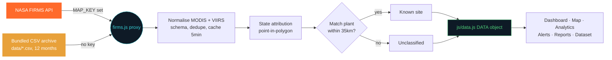
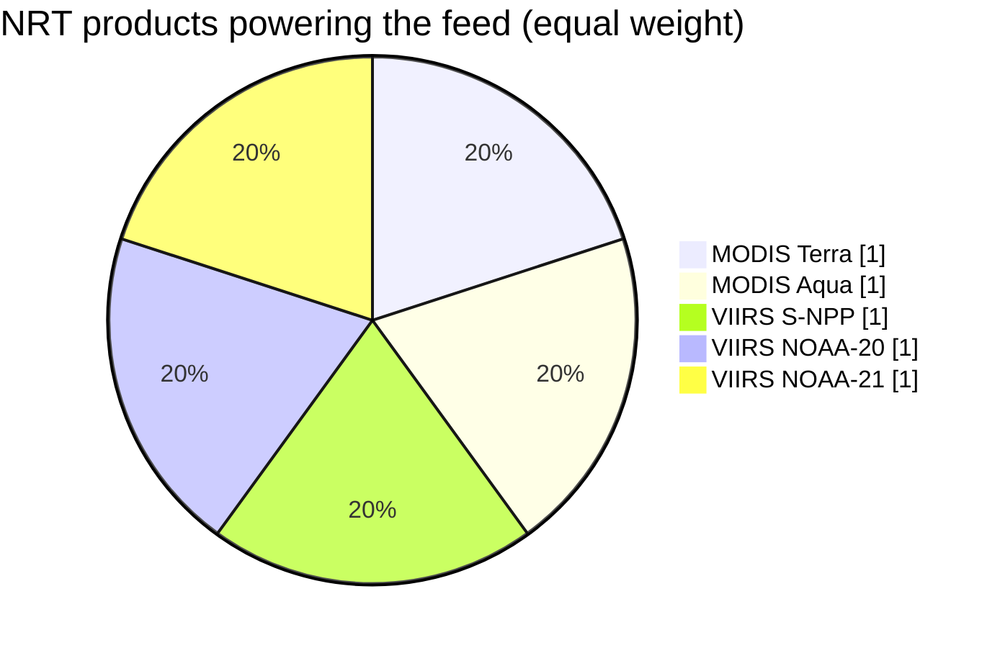
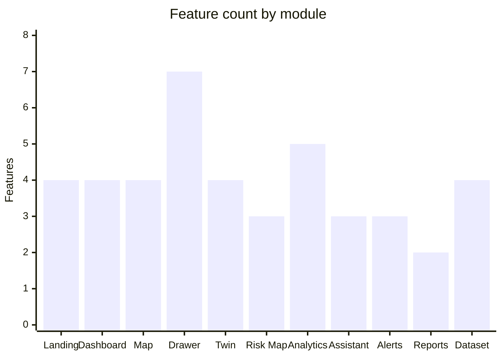
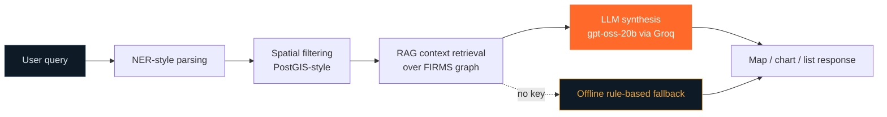

<div align="center">

# 🔥 ThermalWatch AI

**AI-powered detection, classification, prediction and monitoring of industrial fires and persistent thermal sources — over India, from satellite.**

A government-grade thermal intelligence platform, bilingual (English 🇬🇧 / Hindi 🇮🇳), styled after Palantir / NASA Mission Control / ArcGIS.
Built by **Team NEON NEXUS**.


</div>

---

## 🚀 Run it

```bash
npm start          # or: node server.js
# open http://localhost:8080
```

No build step, no dependencies to install for the frontend — it's a static SPA served by a tiny Node server (`server.js` + `firms.js` proxy). CDN libraries (Leaflet, Chart.js, jsPDF, docx) load in the browser.

---

## 🛰️ Data source: demo archive vs live NASA FIRMS API



**Demo mode (default, no key needed).** The app ships with a bundled **NASA FIRMS CSV archive** — four NRT products (MODIS Terra/Aqua + VIIRS S-NPP/NOAA-20/NOAA-21, `data/*.csv`) covering ~12 months of real detections over India. The map, dashboard, analytics, alerts and dataset explorer are all fed by these records (the live map shows the most recent 30 days; analytics & the dataset explorer span the full year). The navbar shows an amber **FIRMS DEMO** badge.

**Live mode (online).** Click the data badge in the navbar, choose **Live Mode**, paste your NASA MAP_KEY and hit **Apply & Sync** — the app fetches fresh detections from the FIRMS API (last 5 days, cached 5 minutes server-side) and hot-swaps them in without a page reload. You can also start the server with `FIRMS_API_KEY=your_key_here npm start` (or set it in `.env` — see `.env.example`), which always wins for live mode. Get a free key at [firms.modaps.eosdis.nasa.gov/api/map_key](https://firms.modaps.eosdis.nasa.gov/api/map_key/).

The green **LIVE FIRMS** badge confirms the live feed is active. If the API fails (network, rate limit, revoked key) it falls back to the bundled CSV archive. The UI paints instantly (bundled sample) and syncs the chosen data source in the background, so live-mode latency never blocks the page.

Optional env vars: `FIRMS_BBOX` (default `67.0,6.0,98.5,37.5`), `FIRMS_SOURCES` (default all four NRT products), `FIRMS_DAYS` (1–5), `FIRMS_INCLUDE_OUTSIDE=1` (keep detections from neighbouring countries inside the bbox), `PORT`.

### Satellite products in the feed



---

## 🧠 What's inside


> If your Markdown viewer doesn't render `xychart-beta` (older Mermaid), see the table below — GitHub.com renders it natively.

| Module | Highlights |
|---|---|
| **Landing** | Animated satellite-orbit canvas, live hotspot pulses, thermal sweep, live stats, detection ticker |
| **Dashboard** | 8 animated KPI cards (count-up + sparklines), live detection feed, national risk gauge, active zones |
| **Live GIS Map** | Leaflet satellite/street/terrain basemaps, VIIRS-style heat layer, risk-circle layer, every live FIRMS detection clustered into color-coded fire-area hotspots |
| **Hotspot Drawer** | Full FIRMS metadata, severity, risk score, AI classification (confidence + explainable reasoning), SHAP/LIME charts, 45-day temporal timeline, 6/12/24/48h prediction gauge, thermal signature fingerprint radar, news correlation, fire-spread simulation, recommendations |
| **Industrial Digital Twin** | Per-plant normal vs current thermal range, historical/abnormal events, risk index, anomaly banners |
| **Risk Map** | Choropleth of 35 Indian states by risk score; click a state for district-level hotspots, incidents, alerts |
| **Analytics** | Hotspots by month/state, industrial fires by industry, flares by region, active zones, satellite heatmap of India — 12m / 3m views |
| **AI Assistant** | Live LLM (Groq `gpt-oss-20b`) with RAG context injection over the FIRMS graph, intent-driven map/chart/list responses, offline rule-based fallback |
| **Alerts** | Real-time alert feed (new fire, anomaly, explosion, spread, environment), severity filters, Dashboard/Email/SMS channel toggles |
| **Reports** | One-click **PDF** (jsPDF) and **DOCX** (docx.js) incident dossiers with live preview |
| **Dataset** | NASA FIRMS-schema explorer — all live detections (thousands), search, filter, sort, paginate, CSV export |

---

## 🛰️ Data

All records follow the NASA FIRMS (MODIS / VIIRS) schema: `latitude, longitude, brightness, scan, track, acq_date, acq_time, satellite, instrument, confidence, bright_t31, frp, daynight, type`.

### What is real vs derived (be precise — this matters)

| Layer | Live mode (`FIRMS_API_KEY` set) | Demo mode (no key) |
|---|---|---|
| **Detections** | **Real NASA FIRMS** MODIS/VIIRS records fetched by the `firms.js` proxy; pixels are merged into fire areas (8 km radius), attributed to a **real state via point-in-polygon** over the bundled India boundary GeoJSON, and matched to a known plant when within 35 km — otherwise honestly labelled **Unclassified** | **Real NASA FIRMS records** from the bundled 12-month CSV archive (`data/*.csv`, MODIS + VIIRS, thinned to one detection per satellite/day/cell); same clustering, state attribution and site matching as live mode |
| **Site names / districts / states** | Real industrial geography from `SEED_SITES` when a cluster matches; otherwise honestly labelled **Unclassified** | Real industrial geography from `SEED_SITES` |
| **Brightness / FRP / confidence / time** | **Real measurements** straight from FIRMS | Generated by a seeded PRNG |
| **Severity, risk score, pattern, history, predictions, fingerprint, SHAP** | **Heuristic derivations computed from the real measurements** (thresholds on FRP/brightness, daily means, trend stats) — no randomness | Seeded random + heuristics |
| **News correlation** | **Disabled** — no simulated headlines are presented as real | Generated sample headlines |
| **Wind / terrain (spread simulation only)** | Synthetic inputs to the ⚡ Simulate tool (a what-if sandbox, not observations) | Same |
| **Basemaps, state boundaries** | Real (ESRI/OSM tiles, India GeoJSON) | Same |

### How it works

- `firms.js` (server) either fetches the live `MODIS_NRT`, `VIIRS_SNPP_NRT`, `VIIRS_NOAA20_NRT`, `VIIRS_NOAA21_NRT` products for the India bounding box, or serves the **precomputed demo archive** `data/demo_records.json.gz` (parsed + thinned + state-attributed once by `node scripts/build-demo-json.js`, ~226k records, 4 MB gzipped — no cold-start CSV parse, so hosts with small memory like Render don't OOM/502). Both paths normalise MODIS (`brightness`/`bright_t31`) and VIIRS (`bright_ti4`/`bright_ti5`) fields into one schema, dedupe, keep only detections inside India's state boundaries (the bbox also reaches Sri Lanka/Pakistan/Bangladesh/Nepal/Myanmar — override with `FIRMS_INCLUDE_OUTSIDE=1`) and cache for 5 minutes. Set `FIRMS_REBUILD_DEMO=1` (or delete the `.json.gz`) to fall back to re-parsing `data/*.csv` on demand.
- `js/data.js` `initData()` runs at boot: success replaces `DATA` with the pipeline (live or demo); any failure (no key, network, server 502, zero records) **resets `DATA` to the bundled seeded sample** and flags `DATA_META.live = false`, which drives the navbar badge and analytics note — the UI never shows stale records from the previous data source.
- Derived numbers are honest: in live and CSV-demo modes no KPI offsets are added, no fake alerts are injected, and the seasonal chart smoothing is skipped.

---

## 🤖 LLM

- Model: `openai/gpt-oss-20b` via Groq. The key is **server-side only** — set `GROQ_API_KEY` in `.env` (copy `.env.example` → `.env`) and calls are proxied through `/api/ai/chat`; the browser never sees the key. Without it the assistant falls back to the offline rule-based replies.
- Pipeline: NER-style query parsing → PostGIS-style spatial filtering → RAG context retrieval → LLM synthesis.



---

## 🏗️ Tech stack

**Data & geospatial**
`NASA FIRMS` `Sentinel-2` `PostGIS` `GeoServer` `OpenStreetMap / ESRI`

**Modeling**
`FastAPI` `XGBoost` `Vision Transformers`

**Frontend & reporting**
`Leaflet` `Chart.js` `jsPDF` `docx.js`

---

<div align="center">

© 2026 ThermalWatch AI · Team NEON NEXUS · Made for Bharat 🇮🇳

</div>
